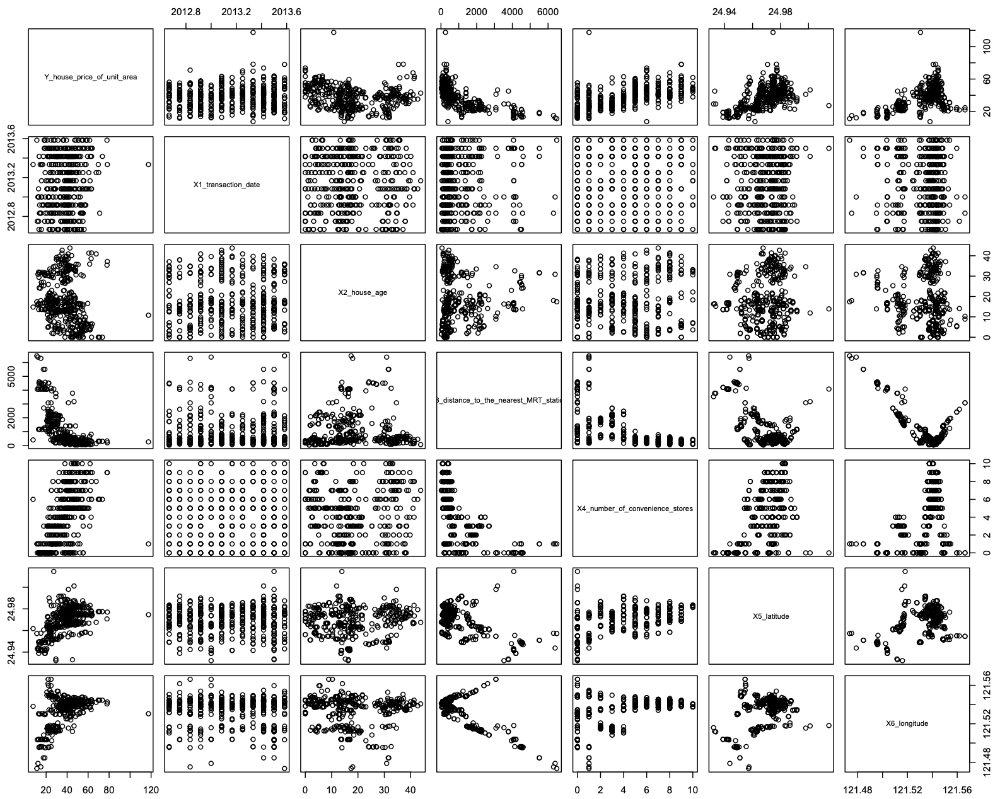

# Statistical Modeling of Housing Prices

  

  <em>Exploratory analysis of relationships between housing price and predictor variables.</em>

This project investigates how structural, accessibility, and spatial characteristics influence housing prices using classical statistical modeling techniques.

The analysis applies regression modeling, feature engineering, dimensionality reduction, and bootstrap inference to understand the factors that drive property values.

The dataset contains housing transactions from the Sindian District of New Taipei City, Taiwan.

## Problem

Housing prices are influenced by multiple factors including:

* property characteristics

* accessibility to transportation

* neighborhood amenities

* geographic location

However, these relationships are often nonlinear and may contain spatial correlation, which can violate standard regression assumptions.

This project investigates:

* Which predictors significantly influence housing price
* Whether nonlinear transformations improve model fit
* How spatial information affects price prediction
* The uncertainty of model coefficients
* Classification of high-value properties

## Dataset

Real Estate Valuation Dataset
(UCI Machine Learning Repository)

Observations: 414
Predictors: 6

Variables include:

* Transaction date
* House age
* Distance to MRT station
* Number of nearby convenience stores
* Latitude
* Longitude

Response variable:

* House price per unit area

## Methodology

The analysis follows a structured statistical modeling workflow:

1. Exploratory Data Analysis

* Distribution analysis
* Pairwise scatter plots
* Identification of nonlinear patterns

2. Baseline Linear Regression

A multiple linear regression model was fitted using all predictors.

Diagnostic plots revealed violations of linearity and heteroscedasticity.

3. Feature Engineering

To improve model fit, several transformations were introduced:

* quadratic term for house age
* log transformation of distance to MRT
* PCA on geographic coordinates

These transformations improved adjusted $R^2$ by approximately 0.08.

4. Bootstrap Inference

Two bootstrap methods were implemented:

* Case bootstrap
* Residual bootstrap

Using 5000 resamples to estimate coefficient variability.

5. Classification Model

A logistic regression model was built to classify whether properties exceed the median price.

LASSO regularization with cross-validation was used for feature selection.

Key Findings

The analysis reveals several important drivers of housing price:

* Distance to MRT stations negatively affects housing prices
* Number of nearby convenience stores is positively associated with higher prices
* Spatial location explains additional variation in property values
* Feature engineering significantly improves regression diagnostics
* Bootstrap analysis shows that coefficient estimates are stable across resampled datasets.

## Skills Demonstrated

### Statistical Modeling

* Multiple Linear Regression
* Logistic Regression
* LASSO Regularization

### Statistical Inference

* Bootstrap Methods
* Residual Diagnostics
* Model Comparison
* Machine Learning Concepts
* Feature Engineering
* Dimensionality Reduction (PCA)

## Tools

* Python
* NumPy
* Pandas
* Statsmodels
* Scikit-learn
* Matplotlib
